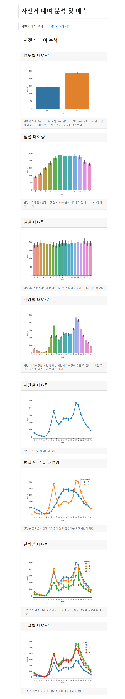
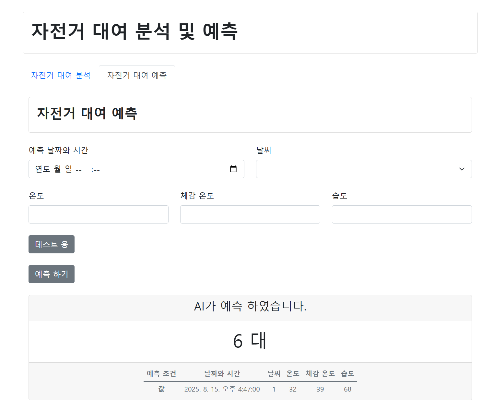

# 자전거 수요 예측 인공지능 웹 플랫폼 소개
- 사용한 데이터
    - [캐글 자전거 수요 예측](https://www.kaggle.com/c/bike-sharing-demand)
- 자전거 수요 데이터를 탐색적 분석을 하고 시각화 한 이미지를 웹으로 보여준다. 웹은 스벨트로 제작하였다.   

- 데이터를 전처리하고 학습시킨 다음 모델을 피클로 내보내기 한 후 플라스크 서버에서 REST API로 예측에 필요한 데이터가 스벨트로 만든 웹에서 전송되면 예측을 하여 리턴하도록 만들었다.

